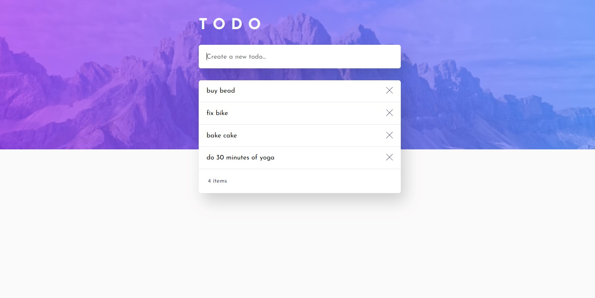

# TODO list

This Todo List application is a practical example of using TypeScript with React to build a reliable and maintainable web application.
The goal of creating this application was to begin learning the basics of TypeScript.

Live - https://my-to-do-application-new.web.app/

The application has simple features:

-Add new todos to the list
-Delete todos from the list
-View the optimal layout for the app depending on their device's screen size
